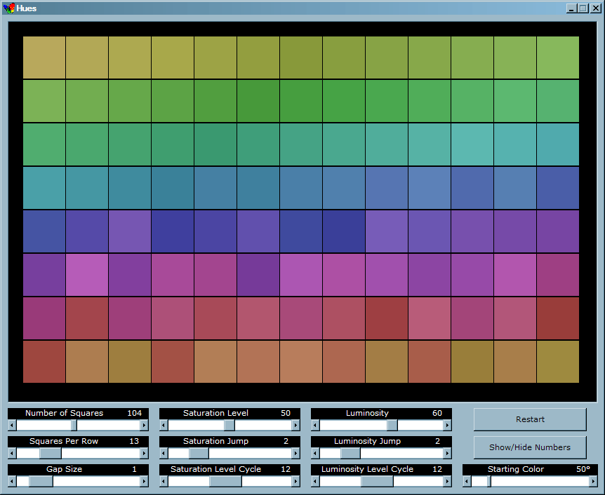



## Hues \(color vision test / game\)

### Description

This program was inspired by the Farnsworth-Munsell 100 hue test which measures how good a person's color vision is.

Each row, when in its proper order, contains a number of color swatches, each one just a slightly different color than its neighboring squares. The program starts with each row randomly mixed up (except the squares to the far left and right) and you have to put them in order by dragging and dropping squares to the left or right.

I've included many parameters you can adjust to make the task more challenging/interesting. When you want to check your accuracy click the "Show/Hide Numbers" and a number will appear on each square, indicating its proper position. Squares in the right position will show white numbers and those out of position will have red numbers.

In addition to being a good color vision test I've found it's kind of fun to just play as a game (for me at least).
 
### More Info
 

             |
---                |---
**Submitted On**   |2009-07-28 10:28:50
**By**             |[Jeremiah Hughes](https://github.com/Planet-Source-Code/PSCIndex/blob/master/ByAuthor/jeremiah-hughes.md)
**Level**          |Advanced
**User Rating**    |5.0 (10 globes from 2 users)
**Compatibility**  |VB 6\.0
**Category**       |[Games](https://github.com/Planet-Source-Code/PSCIndex/blob/master/ByCategory/games__1-38.md)
**World**          |[Visual Basic](https://github.com/Planet-Source-Code/PSCIndex/blob/master/ByWorld/visual-basic.md)
**Archive File**   |[Hues\_\(colo2158687282009\.zip](https://github.com/Planet-Source-Code/jeremiah-hughes-hues-color-vision-test-game__1-72317/archive/master.zip)

